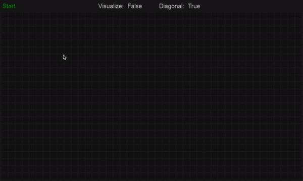

# Path Finding Algorithm

Find the shortest path between two points using the Breadth-first search (BFS) algorithm.

 

## Installation
`$ git clone https://github.com/dnellessen/path-finding-algorithm.git`\
or download ZIP.

## Usage
`$ python3 /path/main.py`

### In GUI
- Click (and drag cursor) to draw a tile. 
- <kbd>Space</kbd> → Start finding path.
- <kbd>S</kbd> → Select start tile.
- <kbd>E</kbd> → Select end tile.
- <kbd>B</kbd> → Select barrier tile.
- <kbd>R</kbd> → Select remove tile.
- <kbd>V</kbd> → Switch visualize boolean.
- <kbd>D</kbd> → Switch diagonal boolean.
- <kbd>T</kbd> → Insert grid template.
- <kbd>C</kbd> → Clear gird (Skips steps if they don't exist).
    * 1st → Path and visualized tiles.
    * 2nd → Start and end tile.
    * 3rd → Everything.
